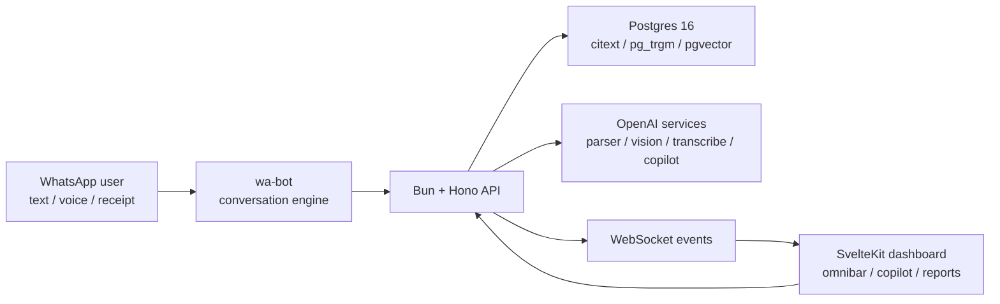

# Versifine

Personal finance that starts where money actually happens: WhatsApp, receipts,
voice notes, and one-line messages.

[](https://github.com/cyberkunju/versifine/actions/workflows/deploy.yml)


Versifine is an India-first personal finance system with a WhatsApp-native
capture flow, a Svelte dashboard, and a finance copilot that is grounded in the
user's own ledger. It is built for the messy, mixed-language way people record
money in real life: "auto inu 200", "2 porotta beef 453 pinne kaappi 54",
voice notes, bill photos, category corrections, and follow-up questions.

It is not a spreadsheet with a chat box bolted on. The product is a complete
loop: capture, classify, confirm, correct, forecast, and ask.

## What It Does

- Logs expenses, income, and transfers from natural language.
- Handles WhatsApp text, voice notes, and receipt photos.
- Understands multilingual Indian usage, including Malayalam/Hindi/Tamil/Telugu/Kannada flows and romanized phrasing.
- Splits multi-item messages into separate transactions instead of flattening the bill.
- Links WhatsApp and web accounts by phone/email, with explicit conflict handling.
- Streams a dashboard copilot over SSE and broadcasts live ledger updates over WebSocket.
- Builds budgets, goals, recurring spend detection, reports, and short-horizon forecasts.
- Learns from corrections so future categorization gets sharper.

## Product Surface

| Surface | Purpose |
| --- | --- |
| WhatsApp bot | Fast capture without opening an app: text, voice, photo, query, budget, correction. |
| Web dashboard | Omnibar capture, transactions, wallets, budgets, goals, forecast, reports, copilot. |
| API | Auth, capture pipeline, parser, categorizer, event fan-out, reports, forecasting, copilot tools. |
| Shared package | Zod contracts, event types, languages, categories, and cross-app schemas. |

## Architecture



The API is the only database writer. The bot never touches Postgres directly;
it talks to the API through typed bot-authenticated endpoints. That keeps auth,
validation, parsing, wallet selection, categorization, embeddings, budget
recomputation, and event emission in one place.

## Repository Map

```text
apps/
  api/      Bun + Hono backend, Drizzle schema, capture pipeline, copilot, reports
  web/      SvelteKit dashboard, PWA shell, omnibar, copilot panel
  wa-bot/   WhatsApp bridge, conversation engine, voice/image handling
packages/
  shared/   Zod schemas, categories, languages, event contracts
scripts/    database bootstrap, deploy scripts, smoke/probe helpers
docs/       architecture notes, stack decisions, deployment notes, status logs
```

## Core Workflows

### Capture

```text
"spent 450 on auto"
"Food-inu 200 spent aayi"
"2 porotta beef motham 453 pinne kaappi 54"
```

The capture pipeline classifies intent, extracts structured transaction data,
normalizes currency/date/wallet hints, persists the transaction, emits live
events, and recomputes affected budgets.

### Correct

```text
"last one was transport not food"
```

Corrections update the transaction and persist category learning for future
similar entries.

### Ask

```text
"how much did I spend on food this month?"
"what is my biggest recurring expense?"
"can I stay under my transport budget?"
```

The copilot is finance-scoped and grounded in the user's own data. It uses
server-side tools instead of guessing from chat history.

## Local Development

Requirements:

- Bun 1.3+
- PostgreSQL 16+
- `pgvector`, `pg_trgm`, `citext`, `pgcrypto`
- OpenAI API key for AI parsing, transcription, vision, and copilot paths
- A WhatsApp number for local bot pairing

```bash
bun install
bun run db:init
cp .env.example .env
bun run db:migrate
bun run db:seed
bun run dev
```

Local URLs:

- Web: `http://localhost:5173`
- API: `http://localhost:5000`
- WhatsApp QR: `http://localhost:5001/qr`

Seeded demo login:

```text
demo@versifine.com
Versifine#2026!
```

## Quality Bar

```bash
bun run typecheck
bun run test
```

Current coverage focuses on:

- parser fallbacks and LLM batch parsing
- WhatsApp conversation flows
- email/account linking behavior
- categorization and Indian merchant handling
- forecast behavior
- unknown/out-of-scope routing
- capture confirmation recovery

## Deployment

Pushes to `main` deploy automatically through GitHub Actions to the Reticule
EC2 target. The remote deploy script builds the workspaces, runs migrations,
syncs the monorepo into `/opt/versifine/repo`, installs nginx/systemd files,
and restarts only services whose runtime output changed.

Operational runbook: [`scripts/AWS-DEPLOY.md`](scripts/AWS-DEPLOY.md)

## Design Principles

- Capture must be faster than opening a banking app.
- The bot should act on clear user intent immediately.
- AI is allowed to parse and explain, not silently invent financial facts.
- Every important wire shape is typed and validated at the boundary.
- The WhatsApp and web surfaces should resolve to the same account, not two ledgers.
- Local-first development should stay boring: Bun, Postgres, typed tests, no hidden services.

## Status

Versifine is an active build with a working web dashboard, API, WhatsApp bot,
production deployment, and seeded demo data. It is still pre-public-release;
expect rapid iteration in flows, copy, and infrastructure.

## License

Proprietary. All rights reserved during the build phase.
